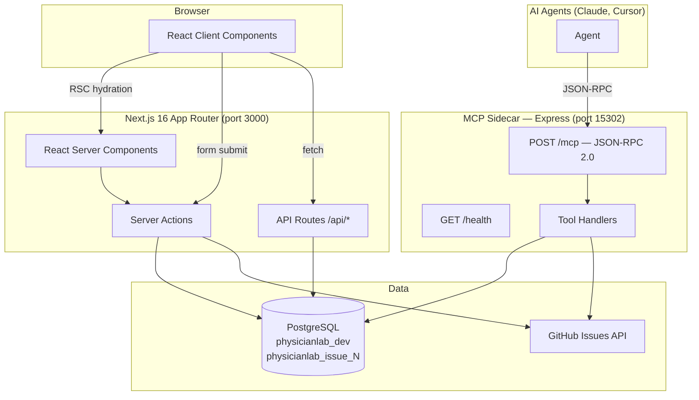
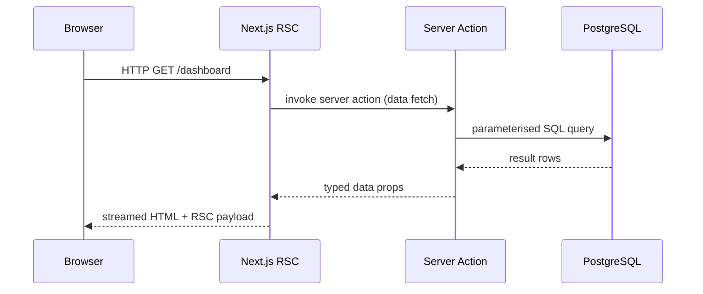
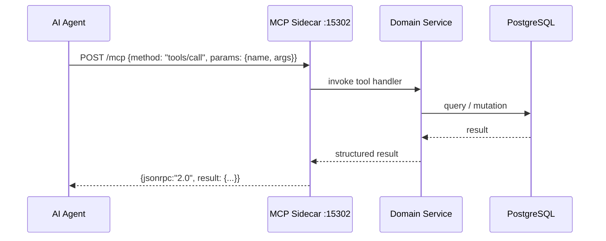
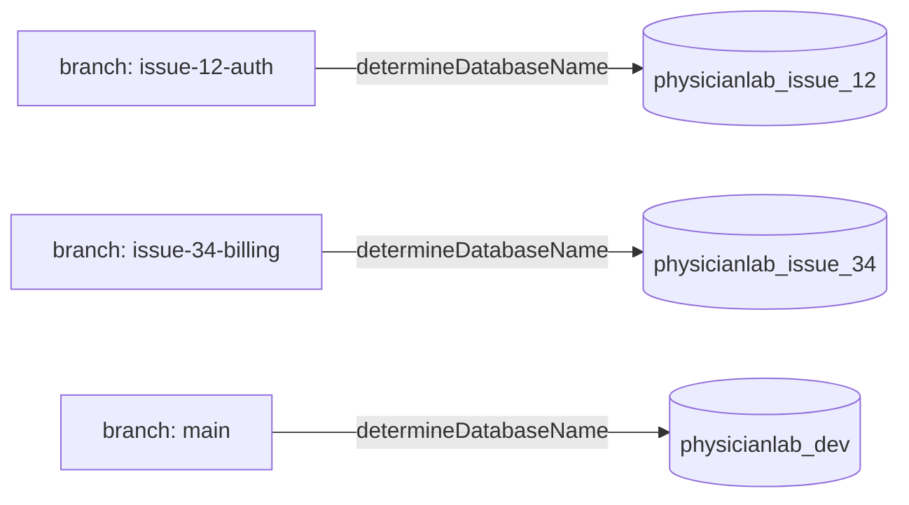

# Architecture Documentation: PhysicianLabs

## 1. Overview

PhysicianLabs is a HealthTech SaaS platform for healthcare providers — clinics, individual doctors, and small care centres. It is a **layered monolith** built on Next.js 16 (App Router), backed by PostgreSQL, with a standalone Express MCP sidecar that exposes AI-callable tools to autonomous agents. The system is designed API-first: all business logic lives in server actions or API routes, client components stay purely presentational, and every endpoint is authenticated via role-based access control (provider / admin / patient).

---

## 2. Tech Stack Choices

| Category | Choice | Rationale |
|:---|:---|:---|
| **Language** | TypeScript 5 (strict) | Type safety across full stack; catches PHI-handling bugs at compile time |
| **Runtime** | Node.js v24 | LTS stability; native `fetch`, `WebCrypto`, permission model |
| **Frontend framework** | Next.js 16 (App Router, Turbopack) | React Server Components reduce client JS; SSR aids SEO and initial load for clinical dashboards |
| **Styling** | Tailwind CSS v4 | Utility-first; consistent design tokens; integrates with `@tailwindcss/postcss` |
| **Backend API** | Next.js Server Actions + API Routes | Collocated with the frontend; eliminates a separate Express app for the primary API |
| **AI sidecar** | Express 4 (MCP server) | Lightweight JSON-RPC 2.0 server for AI agent tool calls; decoupled from the Next.js request lifecycle |
| **Database** | PostgreSQL (via `pg`) | ACID compliance essential for healthcare records; branch-scoped DB isolation for parallel dev |
| **Testing** | Jest + ts-jest (unit/integration), Playwright (e2e, planned) | Jest for server-side logic; Playwright for full browser flows |
| **Issue tracking** | GitHub Issues (`moamalleck/PhyLabs`) | Integrated with FRAIM; issues filed programmatically via `src/issues.ts` |
| **Linting** | ESLint 9 + `eslint-config-next` | Enforces Next.js best practices; catches common RSC/client boundary mistakes |

---

## 3. Architectural Layers

### 3.1 Presentation Layer — `src/app/`
- **Responsibility**: Rendering UI, routing, and user interaction. All components here are either React Server Components (default) or explicitly opted-in client components (`'use client'`).
- **Key modules**:
  - `src/app/layout.tsx` — Root layout: Geist font variables, Tailwind base, global metadata
  - `src/app/page.tsx` — Home route (placeholder; will become the provider dashboard shell)
  - `src/app/globals.css` — Global Tailwind styles and CSS custom properties

### 3.2 Application Layer — `src/app/` server actions + `src/app/api/` *(planned)*
- **Responsibility**: Business logic, input validation, orchestration of domain services. Lives exclusively in server actions and Next.js route handlers — never in client components.
- **Key modules** *(to be created per feature)*:
  - `src/app/api/<resource>/route.ts` — REST-style endpoints for mobile clients or third-party integrations
  - `src/app/<feature>/actions.ts` — Form-bound server actions (authentication, patient record CRUD, appointment management)

### 3.3 Domain Services Layer — `src/services/` *(planned)*
- **Responsibility**: Reusable, framework-agnostic business logic (appointment scheduling, billing, clinical note processing). Consumed by server actions and MCP tool handlers.
- **Key modules** *(to be created)*:
  - `src/services/auth.ts` — RBAC token validation, session management
  - `src/services/patients.ts` — Patient record operations
  - `src/services/appointments.ts` — Scheduling logic

### 3.4 Data Layer — `src/models/` + PostgreSQL *(planned)*
- **Responsibility**: All database access. Uses the `pg` client directly or a thin query-builder layer.
- **Key modules** *(to be created)*:
  - `src/models/patient.ts`, `src/models/provider.ts`, `src/models/appointment.ts`
  - `src/lib/db.ts` — PostgreSQL connection pool (branch-aware via `determineDatabaseName()`)

### 3.5 Infrastructure / Utilities Layer — `src/core/`
- **Responsibility**: Cross-cutting concerns that are framework-independent.
- **Key modules**:
  - `src/core/utils/git-utils.ts` — Port allocation (`getPort`), branch-scoped database naming (`determineDatabaseName`), branch detection (`getCurrentGitBranch`)
  - `src/issues.ts` — GitHub issue filing with client identity injection and dry-run support

### 3.6 MCP Sidecar — `src/mcp-server.ts`
- **Responsibility**: A standalone Express server exposing AI-callable tools to autonomous agents (Claude, Cursor, etc.) via JSON-RPC 2.0. Runs alongside the Next.js process on a separate port.
- **Key endpoints**:
  - `GET /health` — Readiness probe; returns `{"status":"ok","service":"physician-labs-mcp"}`
  - `POST /mcp` — JSON-RPC 2.0 dispatcher: `initialize`, `tools/list`, `tools/call`

---

## 4. Key Components & Modules

### 4.1 `src/app/layout.tsx` — Root Layout
Registers Geist Sans and Geist Mono font variables, applies Tailwind's `antialiased` and `h-full` utilities, and wraps all routes in a flex column body. Sets global `<html>` metadata.

### 4.2 `src/core/utils/git-utils.ts` — Development Infrastructure
Three exported functions used across the project:
- `getPort()` — maps the current git branch's issue number to a unique TCP port via `10000 + (issueNum % 55535)`, with env-var fallback chain ending at `15302`.
- `determineDatabaseName()` — returns `physicianlab_issue_<N>` for issue branches, `physicianlab_prod` in production, `physicianlab_dev` otherwise. Enables parallel development without cross-branch data contamination.
- `getCurrentGitBranch()` — wraps `git rev-parse` with a 2 s timeout to prevent hangs.

### 4.3 `src/mcp-server.ts` — MCP Sidecar
Standalone Express server bootstrapped on the git-allocated port. Implements the MCP protocol handshake (`initialize`) and provides `tools/list` and `tools/call` extension points. New AI-callable tools (e.g. `create_appointment`, `file_issue`, `query_patient`) are registered here as features are built.

### 4.4 `src/issues.ts` — GitHub Issue Filing
Single `fileIssue()` entry point. Prepends a client identity block (filed-by email, agent name, context) to every issue body for traceability. Supports dry-run mode. Reads `GITHUB_TOKEN`, `REPO_OWNER` (`moamalleck`), and `REPO_NAME` (`PhyLabs`) from environment.

### 4.5 `src/__tests__/` — Test Infrastructure
- `test-utils.ts` — `BaseTestCase` interface + tag-filtered `runTests<T>()` runner. Supports `--tags=`, `TAGS=`, and `EXCLUDE_TAGS=` for selective suite execution.
- `shared-server-utils.ts` — `startTestServer()` / `stopTestServer()` lifecycle, `waitForServer()` health polling, `sendMCPRequest()` JSON-RPC helper, `isPortInUse()` conflict detection.

---

## 5. Data Flow

### 5.1 Clinical Web Request (Browser → Database)

### 5.2 AI Agent Tool Call (Agent → MCP → Data)

### 5.3 Developer Branch Isolation

---

## 6. Design Patterns & Principles

- **API-first**: All business logic in server actions or API routes. Client components are purely presentational — no `fetch`, no business rules, no direct DB access.
- **RBAC from day one**: Every server action and API route validates the caller's role (`provider` / `admin` / `patient`) before any data operation.
- **HIPAA-awareness**: PHI (patient names, DOB, diagnoses, insurance) is never logged, never exposed in URL parameters, and always handled in server-only code paths.
- **Branch-scoped database isolation**: `determineDatabaseName()` gives every issue branch its own PostgreSQL database, preventing data collisions during parallel feature development.
- **Issue-based port allocation**: `getPort()` maps git branches to deterministic TCP ports, enabling multiple branches to run concurrently without manual port management.
- **MCP sidecar pattern**: AI tooling is decoupled from the Next.js request lifecycle. The sidecar can be restarted, versioned, or replaced without touching the web application.
- **WCAG 2.1 AA accessibility**: Applied at the component level to all UI — required for healthcare UIs serving users with disabilities.

---

## 7. Configuration & Environment

**FRAIM config**: `fraim/config.json` — mode `integrated`, GitHub repo `moamalleck/PhyLabs`.

**Environment variables** (see `.env.example`):

| Variable | Purpose | Required |
|---|---|---|
| `POSTGRES_HOST` | PostgreSQL host | Yes |
| `POSTGRES_PORT` | PostgreSQL port (default 5432) | Yes |
| `POSTGRES_USER` | Database user | Yes |
| `POSTGRES_PASSWORD` | Database password | Yes |
| `POSTGRES_DB` | Override branch-computed DB name | No |
| `GITHUB_TOKEN` | PAT with `repo` scope for issue filing | Yes (for issue filing) |
| `REPO_OWNER` | GitHub owner (default: `moamalleck`) | No |
| `REPO_NAME` | GitHub repo name (default: `PhyLabs`) | No |
| `NEXTAUTH_SECRET` | Next.js auth signing secret | Yes (auth) |
| `NEXTAUTH_URL` | Canonical app URL | Yes (auth) |
| `PORT` / `FRAIM_MCP_PORT` | Override MCP server port | No |
| `FRAIM_BRANCH` | Override git branch detection | No |

---

*Last updated: 2026-04-23 — reflects scaffold state; update after each major feature addition.*
